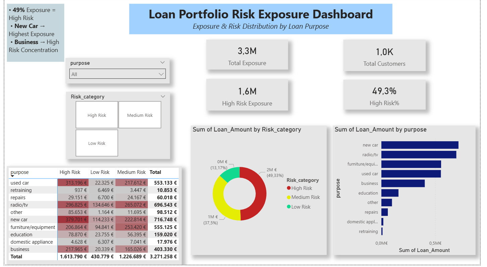

# Loan Portfolio Risk Analysis
## Why I did this project
I created this project to learn how loan data is analyzed in practice and to improve my skills in SQL, Excel and Power BI
I am a 3rd year Economics student and this project helped me understand:
- how credit risk is classified
- how loan portfolios are analyzed
- how to present financial data with dashboards

## Dataset
The dataset was taken from Kaggle and contains information about:
- loan amount
- loan duration
- customer age
- loan purpose

The raw data was first explored and prepared using SQL and Excel.

## Tools Used
- SQL: data preparation and risk classification
- Excel: data analysis and pivot reports
- Power BI: dashboard and data visualization

## SQL – What I did
In SQL, I worked with the loan dataset and customer information.

I used:
- `CREATE TABLE` to create tables
- `INSERT INTO` to add data
- `JOIN` to connect customer data with loan data
- `SELECT` to extract useful columns
- `CASE WHEN` to create risk categories
- `GROUP BY`, `COUNT`, `AVG` for analysis

## Risk Categories
Loans were classified into:
- Low Risk
- Medium Risk
- High Risk

Based on:
- loan amount
- loan duration

This helped me understand how simple business rules can be used in credit risk analysis.

## Excel – What I did
In Excel, I focused on analysis and validation.

I used:
- data cleaning and formatting
- Pivot Tables to analyze loans by:
- risk category
- loan purpose
- charts (bar and pie charts)
- XLOOKUP to find customer information
- slicers to filter data interactively

Excel helped me quickly see patterns and check my results.

## Power BI - what I did
In Power BI, I created an interactive dashboard.

The dashboard shows:
- total loan exposure
- number of customers
- loan exposure by risk category
- loan exposure by loan purpose

I used:
- measures for total and percentage values
- bar charts and donut charts
- slicers for risk category and purpose
Power BI helped me turn data into clear visuals.

## Key Results and Conclusions
From the analysis, I found that:
- almost 50% of the loan portfolio is High Risk
- some loan purposes (like new car and business loans) have higher risk
- risk is not equally distributed across the portfolio

This project helped me understand the importance of risk concentration and portfolio analysis.

## What I learned
- how to work with real financial data
- how SQL, Excel and Power BI work together
- basic concepts of credit risk analysis
- how to present analysis results clearly
- `credit_risk_analysis.sql` – SQL queries and risk logic
- `Loan_Risk_Analysis.xlsx` – Excel analysis and pivot tables
- `Loan_Analysis_Report.pbix` – Power BI dashboard
## Dashboard Preview

